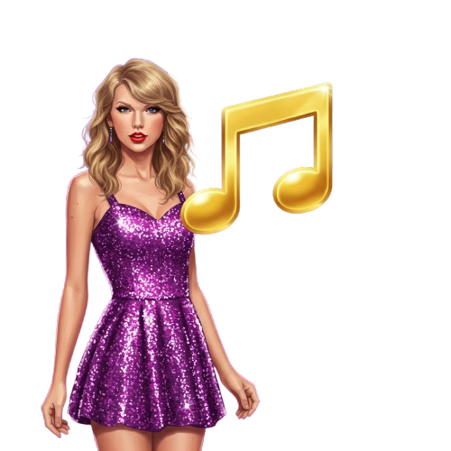

# Swift Guess

<div align="center">
  

  <h3>A Taylor Swift song guessing game for Swifties of all levels</h3>
</div>

## 📥 Download

[Download APK](https://github.com/ashut0shj/swift_guess/releases/download/v1.7/app-release.apk)


## 📱 About

Swift Guess is a Flutter-based mobile game where players test their knowledge of Taylor Swift songs by guessing titles letter by letter. With beautiful UI, multiple difficulty levels, and engaging gameplay, it provides entertainment for casual listeners and die-hard Swifties alike.

## ✨ Features

- **Engaging Gameplay**: Guess Taylor Swift song titles letter by letter
- **Multiple Difficulty Levels**: Choose between Easy, Medium, and Hard modes
- **Hint System**: Use hints strategically when you get stuck
- **Score Tracking**: Compete against yourself with a high score system
- **Beautiful UI**: Enjoy a visually appealing interface with Taylor Swift-inspired colors

## 🎮 How To Play

1. **Select a Difficulty Level**:
   - **Easy**: 8 hearts & 4 hints - Perfect for casual fans
   - **Medium**: 6 hearts & 3 hints - For the regular Swifties
   - **Hard**: 4 hearts & 2 hints - For the die-hard fans

2. **Guess the Song**:
   - Choose letters to reveal parts of the hidden song title
   - Each incorrect guess costs you one heart
   - Use hints to reveal random letters when you're stuck
   - Complete the title before running out of hearts

3. **Scoring System**:
   - Base score for each completed song
   - Bonus points for remaining hearts
   - Penalty for using hints
   - Try to beat your personal best!

## 🛠️ Technical Details

### Requirements

- Flutter SDK
- Dart
- Android Studio / Xcode (for deployment)

### Dependencies

```yaml
dependencies:
  flutter:
    sdk: flutter
  google_fonts: ^6.1.0
  flutter_animate: ^4.5.0
  confetti: ^0.8.0
  lottie: ^3.0.0
  shared_preferences: ^2.2.2
  audioplayers: ^6.4.0
```

### Project Structure

```
lib/
├── main.dart
├── screens/
│   ├── home_screen.dart
│   ├── game_screen.dart
│   ├── how_to_play_screen.dart
│   └── results_screen.dart
├── models/
│   └── song_data.dart
├── widgets/
│   └── ...
└── utils/
    └── ...
```

## 🚀 Installation

1. Clone the repository:
   ```bash
   git clone https://github.com/yourusername/swift-guess.git
   ```

2. Navigate to the project directory:
   ```bash
   cd swift-guess
   ```

3. Install dependencies:
   ```bash
   flutter pub get
   ```

4. Run the app:
   ```bash
   flutter run
   ```


## 🙏 Acknowledgements

- Taylor Swift for the amazing songs
- Flutter community for support and resources
- All Swifties who beta-tested the game

---

<div align="center">
  Made with 💜 for Swifties everywhere
</div>